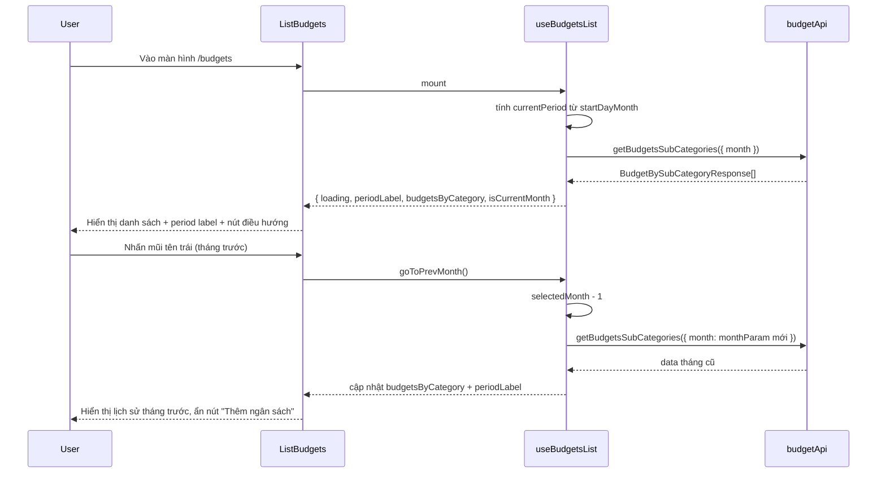

# Technical Design: Cải thiện tính năng Ngân sách

> **Dựa trên**: `01_requirement.md`
> **Ngày thiết kế**: 2026-06-11

---

## 1. Flow Diagram



---

## 2. Component Tree

```
app/(main)/budgets/page.tsx          ← không đổi
└── ListBudgets.tsx                  ← SỬA: thêm MonthNavigator + banner + ẩn/hiện nút thêm
    └── MonthNavigator.tsx           ← TẠO MỚI: nút trái/phải + periodLabel
```

**Component cần tạo mới:**
- `app/components/budgets/MonthNavigator.tsx` — hiển thị `periodLabel` ở giữa, nút `<` bên trái, nút `>` bên phải (disabled khi đang ở tháng hiện tại)

**Component cần sửa:**
- `app/components/budgets/ListBudgets.tsx` — nhận thêm `isCurrentMonth` và `goToPrevMonth` / `goToNextMonth` từ hook; ẩn nút "Thêm ngân sách" khi `isCurrentMonth === false`; hiển thị banner khi `startDayMonth` chưa được cài

---

## 3. State & Hook Design

**Hook cần sửa**: `app/hooks/useBudgetsList.ts`

| State | Type | Mô tả | Khởi tạo |
| :--- | :--- | :--- | :--- |
| `budgets` | `BudgetBySubCategoryResponse[]` | Danh sách budget từ API | `[]` |
| `loading` | `boolean` | Loading khi fetch | `true` |
| `error` | `string \| null` | Lỗi khi fetch thất bại | `null` |
| `selectedMonth` | `Date` | Tháng đang xem (dùng ngày 1 của tháng) | `currentPeriodStart` |

**Logic tính `currentPeriodStart`** (tách ra utility, dùng chung với `useCreateBudget`):
```typescript
// app/utilities/common/functions.ts — thêm mới
export function getCurrentFinancialPeriodStart(startDayMonth: number): Date {
  const today = new Date();
  let year = today.getFullYear();
  let month = today.getMonth(); // 0-indexed
  if (today.getDate() < startDayMonth) {
    month -= 1;
    if (month < 0) { month = 11; year -= 1; }
  }
  return new Date(year, month, 1); // dùng ngày 1 làm anchor
}
```

**Return interface của hook (cập nhật):**
```typescript
interface UseBudgetsListResult {
  loading: boolean;
  error: string | null;
  periodLabel: string;
  budgetsByCategory: CategoryBudgets[];
  isCurrentMonth: boolean;        // để ẩn/hiện nút "Thêm ngân sách"
  hasStartDayMonth: boolean;      // để hiện banner nhắc cài đặt
  goToPrevMonth: () => void;
  goToNextMonth: () => void;
}
```

**Logic điều hướng tháng:**
- `goToPrevMonth`: `setSelectedMonth(prev => subMonth(prev, 1))`
- `goToNextMonth`: `setSelectedMonth(prev => addMonth(prev, 1))`
- `isCurrentMonth`: so sánh `selectedMonth` với `currentPeriodStart` — nếu bằng nhau thì `true`
- `monthParam` tính từ `selectedMonth` + `startDayMonth` (không phải từ `today`)

---

## 4. API Changes

Không cần API mới. `getBudgetsSubCategories` đã nhận param `month: string` — chỉ cần FE truyền đúng tháng được chọn thay vì hardcode tháng hiện tại.

| Method | Endpoint | Thay đổi |
| :--- | :--- | :--- |
| `GET` | `/budgets/sub-categories?month=YYYY-MM` | Đã có — FE cần truyền `monthParam` động theo `selectedMonth` |

---

## 5. TypeScript Types cần thêm

**File**: `app/types/budget.ts`
```typescript
// Không cần thêm type mới — chỉ cập nhật return type của hook trong app/types/budgets.ts

// Sửa UseBudgetsListResult (hiện chưa có, hook đang return implicit):
export interface UseBudgetsListResult {
  loading: boolean;
  error: string | null;
  periodLabel: string;
  budgetsByCategory: CategoryBudgets[];
  isCurrentMonth: boolean;
  hasStartDayMonth: boolean;
  goToPrevMonth: () => void;
  goToNextMonth: () => void;
}
```
